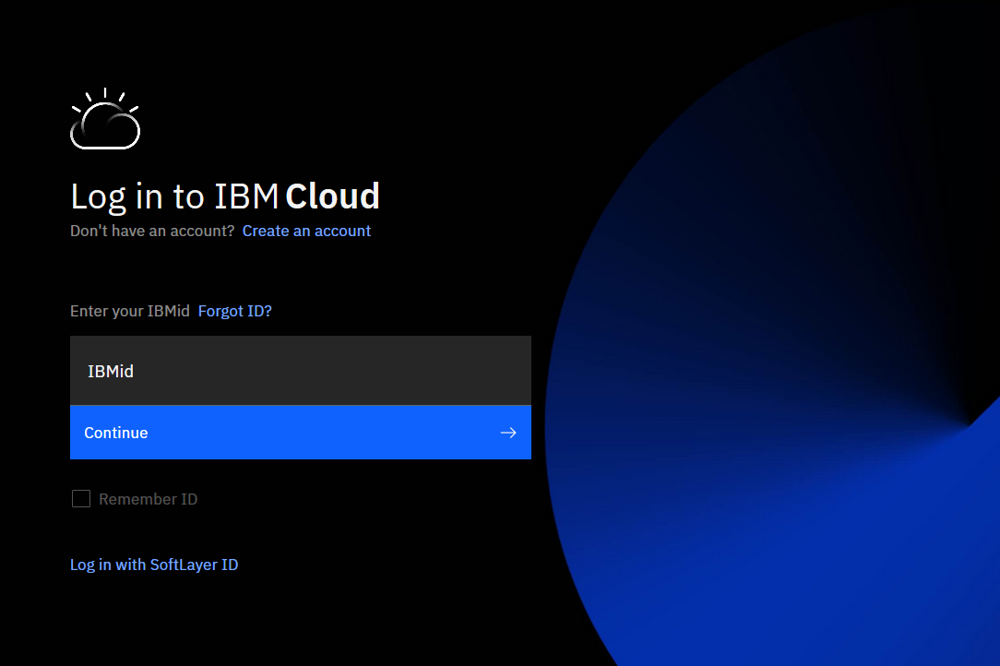
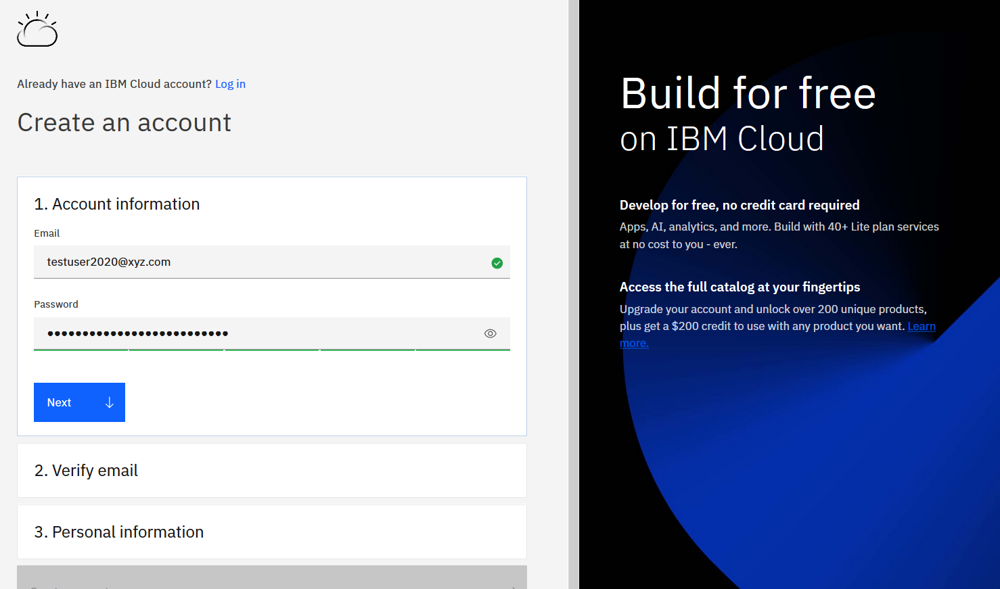
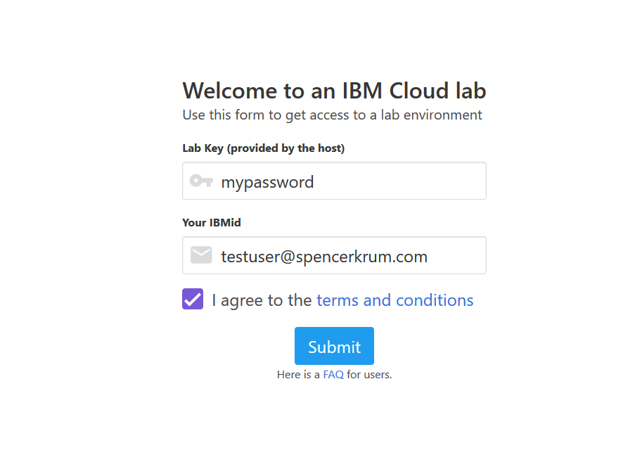
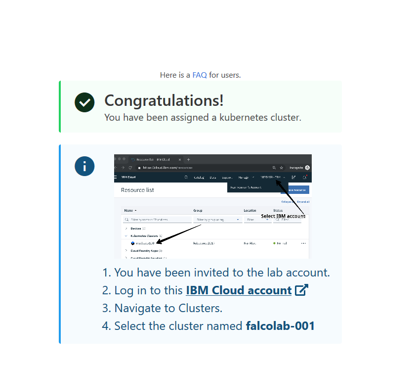
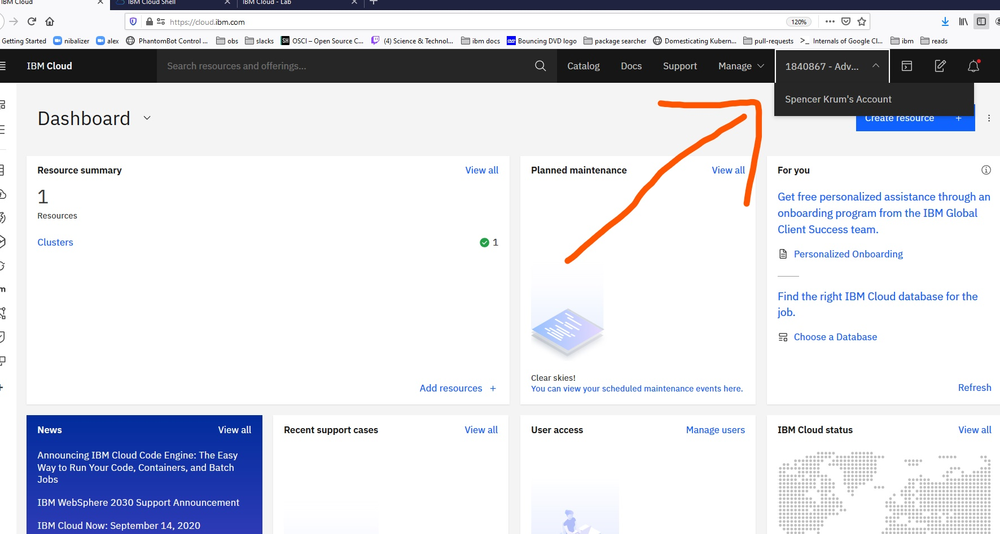
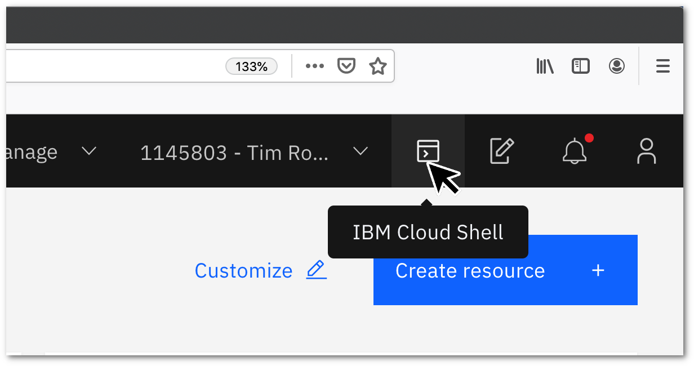
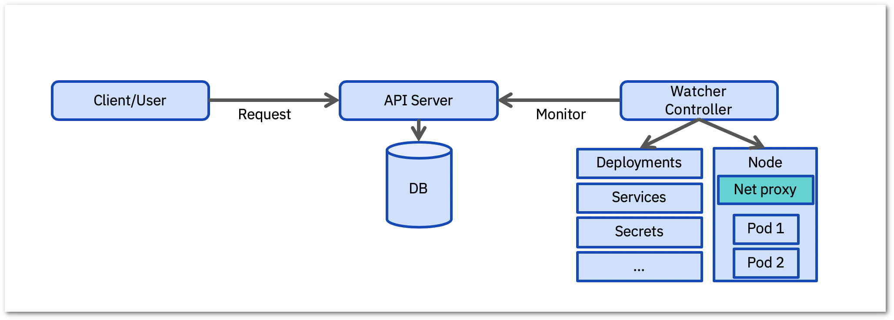

# Falco Workshop

## Spencer Krum


In this workshop you'll be introduced to Falco, a security tool. Falco is a Cloud Native Computing Foundation (CNCF) incubating project and is Open Source(Apache 2 Licensed). 

Falco helps you identify security threats in real time by detecting malicious activity. It works by watching system calls as they are processed by the kernel. This means it's much harder for bad actors to hide from falco, and that falco has first-class container and kubernetes support.


To get you hands on access with Falco we're giving you a free IBM Cloud Account and free IBM Cloud Kubernetes Cluster. You require zero money or credit card info to do this workshop.

Table of Contents

* IBM Cloud Setup
  * Account
  * Cloud Shell
  * Kubernetes Cluster checkout
  * Kubernetes 101 really fast

* Falco and System Calls

* Installing Falco in Kubernetes
  * Verify Kubernetes Configuration
  * Installing Helm
  * Cloning charts repo
  * Configure values.yaml for helm
  * Helm install

* First events
  * Tail logs in pod
  * Create events
  * Switch to json output
  * Read more events, use jq

* Falco sidekick
  * slack output / discord output
  * set custom string in falco sidekick
  * brief view of other outputs

* Write a rule
  * rule edit
  * apply using helm
  * trigger rule
  * adjust macros
  * apply using helm
  * trigger rule
  * write a rule from scratch
  * adjust macros
  * trigger rule

* gRPC
  * configure unix domain socket
  * use go client
  * use python client
  * use rust client
  * for python client - make it do another thing (batch probably)


# Account Setup

Sign up for a free IBM Cloud account or log in here:  http://ibm.biz/202007-containers

> You might want to ask your IBM instructor to whitelist the public IP and or the above signup link at the following registration whitelisting site: https://cloud.ibm.com/registration/whitelist

> If you have already an IBM lite account or a Pay-As-You-Go account please access your IBM Cloud Dashboard by clicking the above link, and check the Step 4 - Next Steps section.





You will need to do a verification step. Tell your instructor if you have any issues.

## Kubernetes cluster assignment

Instead of creating a Kubernetes cluster in your account, we are giving you access to a pre-created cluster in an IBM controlled (and paid) account. This gives you the full paid cluster experience which is superior to the limitations of a free trial and doesn't require you to put in a credit card.

Navigate to the [cluster checkout page](https://falcolab.mybluemix.net). Use the password `ikslab` and use the email you signed up for IBM Cloud with.



You've been given a cluster. You'll see the following view. This means a cluster has been granted to you.



## Switching accounts to the IBM provided account

Return to the main cloud page at [cloud.ibm.com](https://cloud.ibm.com)



Once there, use the user account switcher (see screenshot) to switch accounts to "1840867-IBM". We'll do the majority of the work in this account. If this worked, you should see "1" under the resource summary in the middle left.

# Lab setup - get web terminal and content

## Set up the web terminal

Log in to the [IBM Cloud](https://cloud.ibm.com) to access the dashboard.

Click on the top right terminal icon to launch the **IBM Cloud Shell**.



Run the `ibmcloud ks clusters` command to verify the terminal and setup for access to the cluster

```text
ibmcloud ks clusters
```

> it's ok to ignore warnings you may see about versions of plugins or kubernetes cluster versions

If you don't see any clusters listed, you probably need to switch accounts. See "Switching accounts to the IBM provided account" above.


Configure the `kubectl` cli available within the terminal for access to your cluster.

```text
ibmcloud ks cluster config --cluster mycluster
```

Verify access to the Kubernetes API.

```text
kubectl get namespace
```

You should see output similar to the following, if so, then your're ready to continue.

```text
NAME              STATUS   AGE
default           Active   125m
ibm-cert-store    Active   121m
ibm-system        Active   124m
kube-node-lease   Active   125m
kube-public       Active   125m
kube-system       Active   125m
```

## Clone the lab repository

In some of the labs, you will be creating Kubernetes resources by applyig `.yaml` files representing the desired state for the resource. To save typing in all of that, clone the lab repository into your web terminal:

```text
git clone https://github.com/nibalizer/falco-workshop
```

you should see:

```text
Cloning into 'falco-workshop'...
remote: Enumerating objects: 61, done.
remote: Counting objects: 100% (61/61), done.
remote: Compressing objects: 100% (44/44), done.
remote: Total 61 (delta 13), reused 61 (delta 13), pack-reused 0
Unpacking objects: 100% (61/61), done.
```


# Deploy an application on Kubernetes


This is an optional exercise. If you are new to Kubernetes, these basics will give you some baseline experience (we move quite quickly later).

In this part of the lab we will deploy an application called `guestbook` that has already been built and uploaded to DockerHub under the name`ibmcom/guestbook:v1`. In Kubernetes, creating an application means deploying a set of **pods** that run containers. In this lab, you will begin with the most simple scenario of creating a **deployment** with a single **pod** using the `kubectl` cli.

## Create the application and service

1. Create the `guestbook` application deployment:

   ```text
   kubectl create deployment guestbook --image=ibmcom/guestbook:v1
   ```

   This action will take a bit of time. To check the status of the running application, you can use:

   ```text
   kubectl get pods
   ```

   You should see output similar to the following:

   ```console
   $ kubectl get pods
   NAME                          READY     STATUS              RESTARTS   AGE
   guestbook-59bd679fdc-bxdg7    0/1       ContainerCreating   0          1m
   ```

   Eventually, the status should show up as `Running`.

   ```console
   $ kubectl get pods
   NAME                          READY     STATUS              RESTARTS   AGE
   guestbook-59bd679fdc-bxdg7    1/1       Running             0          1m
   ```

   The end result of the run command is not just the pod containing our application containers, but a **Deployment** resource that manages the lifecycle of those pods.

1. Once the status reads `Running`, we need to expose that deployment as a **Service** so that it can be accessed. By specifying a service type of `NodePort`, the service will also be mapped to a high-numbered port on each cluster node. The `guestbook` application listens on port 3000, so this is also specified in the command.  Run:

    ```text
    kubectl expose deployment guestbook --type="NodePort" --port=3000
    ```

   ```console
   $ kubectl expose deployment guestbook --type="NodePort" --port=3000
   service "guestbook" exposed
   ```

1. To find the port used on that worker node, examine your new service:

    ```text
    kubectl get service guestbook
    ```

   ```console
   $ kubectl get service guestbook
   NAME        TYPE       CLUSTER-IP      EXTERNAL-IP   PORT(S)          AGE
   guestbook   NodePort   172.21.12.235   <none>        3000:30805/TCP   1m
   ```

   The output shows that the `<nodeport>` is `30805`. The service will take incoming connections to the high numbered port, `30805` and forward to port `3000` to the container inside the pod. For a service of type NodePort, a port in the range 30000-32767 is automatically chosen, and could be different for you.

1. `guestbook` is now running on your cluster, and exposed to the internet. We need to find out where it is accessible. The worker nodes running in the container service get external IP addresses. Run `$ ibmcloud cs workers <name-of-cluster>`, and note the public IP listed on the `<public-IP>` line.

    ```text
    ibmcloud ks workers -c mycluster
    ```

    ```console
    $ ibmcloud ks workers -c mycluster
    OK
    ID                                                 Public IP        Private IP     Flavor   State    Status   Zone    Version  
    kube-hou02-pa1e3ee39f549640aebea69a444f51fe55-w1   184.172.252.167  10.76.194.30   free     normal   Ready    hou02   1.14.7_1535
    ```

    We can see that our `<public-IP>` is `184.172.252.167`.

1. Now that you have both the address and the port, you can now access the application in the web browser at `<public-IP>:<nodeport>`. In the example case this is `184.172.252.167:30805`. Enter in a browser tab your IP address and NodePort for your deployment. Try out the guestbook by putting in a few entries. Keep this browser tab handy as you can use it in the next exercise as well.

Congratulations, you've now deployed an application to Kubernetes!

## Understanding what happened

At its core, you can think of Kubernetes as being a highly-available database and a collection of watchers and controllers. Kubernetes objects and their required metadata, such as a name and their desired state, are stored in this database and the watchers and controllers act to ensure that the configuration of actual resources in the cluster matches the state stored in the database.



Included in Kubernetes are a number of basic objects necessary for supporting applications as well as abstractions to simplify the configuration and management of applications. The most common basic object is a [**pod**](https://kubernetes.io/docs/concepts/workloads/pods/pod-overview/) which encapsulates one or more containers along with storage resources, a unique network address and configuration options. The **pod** reflects the smallest unit of deployment. Although **pods** are technically transient, they will usually run until something destroys them, either a human operator or a controller. A [**Deployment**](https://kubernetes.io/docs/concepts/workloads/controllers/deployment/) is an abstraction that you can use to create a deployment of an application. It provides support for horizontally scaling pods, updating the container image used by the pods and also rollbacks.

To create your application, you used the `kubectl` command to create a **deployment** object and provided a name for the deployment, "guestbook", and also the container image to use. These options were combined with defaults for the object to create the desired state that was stored in the database. Reconciliation of the desired state resulted in a single pod being started in the cluster. Then, you used the `kubectl expose` command to make the **deployment** resource accessible both inside and outside of the cluster. This command creates a [**Service**](https://kubernetes.io/docs/concepts/services-networking/service/) for a number of different resource types (deployment, replica set, replication controler, pod) to allow access to a network port on the resource.

### Convenience Aliases

You may want to set up an alias for kubectl to make typing faster. This is optional.

```bash
alias k=kubectl
```


Congratulations, you've finished the preamble. On to the meat of the workshop.  


## Falco and System Calls


[Falco](https://falco.org/) is a cloud-native runtime security system that works with both containers and raw Linux hosts. It is developed by [Sysdig](https://sysdig.com/) and is an [incubating](https://landscape.cncf.io/selected=falco) project in the Cloud Native Computing Foundation. Falco works by looking at file changes, network activity, the process table, and other data for suspicious behavior and then sending alerts through a pluggable back end. It inspects events at the system call level of a host through a kernel module or an [extended BPF](https://en.wikipedia.org/wiki/Berkeley_Packet_Filter) probe. Falco contains a rich set of rules that you can edit for flagging specific abnormal behaviors and for creating allow lists for normal computer operations.

In this tutorial, you learn to install and set up Falco on a Kubernetes cluster on IBM Cloud, create a synthetic security incident, and view the incident in Falco. Then, you send all security incidents into LogDNA for aggregation. Finally, you wire up Falco to send security alerts at run time to Slack. This tutorial works equally well on standard [Kubernetes](https://kubernetes.io/) and on [Red Hat OpenShift on IBM Cloud](https://www.ibm.com/cloud/openshift).

From wikipedia:

> In computing, a system call (commonly abbreviated to syscall) is the programmatic way in which a computer program requests a service from the kernel of the operating system on which it is executed. This may include hardware-related services (for example, accessing a hard disk drive), creation and execution of new processes, and communication with integral kernel services such as process scheduling. System calls provide an essential interface between a process and the operating system. 

System Calls are involved whenever your code is actually doing something on the system. Writing files, reading files, opening network ports, getting the system time, etc all eventually result in a system call being performed. Let's see them in action:


Create a file:

```
[nibz@fermi falco]$ echo "this is a test" > test.txt
```

Dump the file to standard out

```
[nibz@fermi falco]$ cat test.txt
this is a test
```

Imagine that `test.txt` held some data we wanted to keep secure. Any attempt by a program to read that data should be considered a potential breach.

Now run the cat command inside `strace`, which will run the same command but show you which systemcalls are being run. Note that `strace` is not available on the cloud shell. See "Running without strace" below.

```
[nibz@fermi falco]$ strace cat test.txt
execve("/usr/bin/cat", ["cat", "test.txt"], 0x7ffe85066b98 /* 34 vars */) = 0
brk(NULL)                               = 0x55a7ee915000
arch_prctl(0x3001 /* ARCH_??? */, 0x7ffe23bc1780) = -1 EINVAL (Invalid argument)
access("/etc/ld.so.preload", R_OK)      = -1 ENOENT (No such file or directory)
openat(AT_FDCWD, "/etc/ld.so.cache", O_RDONLY|O_CLOEXEC) = 3
fstat(3, {st_mode=S_IFREG|0644, st_size=97284, ...}) = 0
mmap(NULL, 97284, PROT_READ, MAP_PRIVATE, 3, 0) = 0x7f63bc95d000
close(3)                                = 0
openat(AT_FDCWD, "/usr/lib/libc.so.6", O_RDONLY|O_CLOEXEC) = 3
read(3, "\177ELF\2\1\1\3\0\0\0\0\0\0\0\0\3\0>\0\1\0\0\0\220\202\2\0\0\0\0\0"..., 832) = 832
pread64(3, "\6\0\0\0\4\0\0\0@\0\0\0\0\0\0\0@\0\0\0\0\0\0\0@\0\0\0\0\0\0\0"..., 784, 64) = 784
pread64(3, "\4\0\0\0\20\0\0\0\5\0\0\0GNU\0\2\0\0\300\4\0\0\0\3\0\0\0\0\0\0\0", 32, 848) = 32
pread64(3, "\4\0\0\0\24\0\0\0\3\0\0\0GNU\0\364[g\253(\257\25\201\313\250\344q>\17\323\262"..., 68, 880) = 68
fstat(3, {st_mode=S_IFREG|0755, st_size=2159552, ...}) = 0
mmap(NULL, 8192, PROT_READ|PROT_WRITE, MAP_PRIVATE|MAP_ANONYMOUS, -1, 0) = 0x7f63bc95b000
pread64(3, "\6\0\0\0\4\0\0\0@\0\0\0\0\0\0\0@\0\0\0\0\0\0\0@\0\0\0\0\0\0\0"..., 784, 64) = 784
mmap(NULL, 1868448, PROT_READ, MAP_PRIVATE|MAP_DENYWRITE, 3, 0) = 0x7f63bc792000
mmap(0x7f63bc7b8000, 1363968, PROT_READ|PROT_EXEC, MAP_PRIVATE|MAP_FIXED|MAP_DENYWRITE, 3, 0x26000) = 0x7f63bc7b8000
mmap(0x7f63bc905000, 311296, PROT_READ, MAP_PRIVATE|MAP_FIXED|MAP_DENYWRITE, 3, 0x173000) = 0x7f63bc905000
mmap(0x7f63bc951000, 24576, PROT_READ|PROT_WRITE, MAP_PRIVATE|MAP_FIXED|MAP_DENYWRITE, 3, 0x1be000) = 0x7f63bc951000
mmap(0x7f63bc957000, 12960, PROT_READ|PROT_WRITE, MAP_PRIVATE|MAP_FIXED|MAP_ANONYMOUS, -1, 0) = 0x7f63bc957000
close(3)                                = 0
mmap(NULL, 8192, PROT_READ|PROT_WRITE, MAP_PRIVATE|MAP_ANONYMOUS, -1, 0) = 0x7f63bc790000
arch_prctl(ARCH_SET_FS, 0x7f63bc95c5c0) = 0
mprotect(0x7f63bc951000, 12288, PROT_READ) = 0
mprotect(0x55a7ee160000, 4096, PROT_READ) = 0
mprotect(0x7f63bc9a1000, 4096, PROT_READ) = 0
munmap(0x7f63bc95d000, 97284)           = 0
brk(NULL)                               = 0x55a7ee915000
brk(0x55a7ee936000)                     = 0x55a7ee936000
fstat(1, {st_mode=S_IFCHR|0620, st_rdev=makedev(0x88, 0x9), ...}) = 0
openat(AT_FDCWD, "test.txt", O_RDONLY)  = 3
fstat(3, {st_mode=S_IFREG|0644, st_size=15, ...}) = 0
fadvise64(3, 0, 0, POSIX_FADV_SEQUENTIAL) = 0
mmap(NULL, 139264, PROT_READ|PROT_WRITE, MAP_PRIVATE|MAP_ANONYMOUS, -1, 0) = 0x7f63bc76e000
read(3, "this is a test\n", 131072)     = 15
write(1, "this is a test\n", 15this is a test
)        = 15
read(3, "", 131072)                     = 0
munmap(0x7f63bc76e000, 139264)          = 0
close(3)                                = 0
close(1)                                = 0
close(2)                                = 0
exit_group(0)                           = ?
+++ exited with 0 +++
```

In our systemcall output this line appears:

```
openat(AT_FDCWD, "test.txt", O_RDONLY)  = 3
```

By identifying that pairing of systemcal = openat and filename = 'test.txt' we can identify when a potential security event has happened. This is the core of what Falco is going to do for you. 


This falco rule would be able to detect that behavior:


```
- rule: Read secure .txt file
  desc: >
    an attempt to read the secure file test.txt
  condition: >
    fd.name = 'test.txt' and open_read
    and proc_name_exists
    and not proc.name in (whitelisted_programs)
  output: >
    Sensitive file opened for reading by non-trusted program (user=%user.name user_loginuid=%user.loginuid program=%proc.name
    command=%proc.cmdline file=%fd.name parent=%proc.pname gparent=%proc.aname[2] ggparent=%proc.aname[3] gggparent=%proc.aname[4] container_id=%container.id image=%container.image.repository)
  priority: WARNING
  tags: [filesystem, simple_test]

```

And the log line you'd get:

```
Sep 23 20:37:30 nibz-falco-dev falco: {"output":"20:37:30.199241060: Warning Sensitive file opened for reading by non-trusted program (user=root program=cat command=cat test.txt file=/root/test.txt parent=sudo gparent=bash ggparent=sshd gggparent=sshd)","priority":"Warning","rule":"Read sensitive file untrusted","time":"2020-09-23T20:37:30.199241060Z", "output_fields": {"evt.time":1600893450199241060,"fd.name":"/root/test.txt","proc.aname[2]":"bash","proc.aname[3]":"sshd","proc.aname[4]":"sshd","proc.cmdline":"cat /root/test.txt","proc.name":"cat","proc.pname":"sudo","user.name":"root"}}
```

Falco has configuration options to send these alerts to a variety of places. Syslog, slack, discord, lambda, IBM Cloud Functions, are all supported. For extensibility HTTP and gRPC are exposed to write your own sinks for events.


In the following section we'll go through the steps of installing falco, creating events, and processing those events with output tools.

## Running without strace

The cloud shell environment doesn't have strace installed. We'll instead use a binary created by [Liz Rice](https://twitter.com/lizrice). ["Strace in 60 lines of go"](https://medium.com/hackernoon/strace-in-60-lines-of-go-b4b76e3ecd64)

Download the binary from remote server:

```
mytestmytest@cloudshell:~$ wget http://52.117.127.35:8080/strace-from-scratch                                                                                           
 
--2020-09-25 22:50:52--  http://52.117.127.35:8080/strace-from-scratch
Connecting to 52.117.127.35:8080... connected.
HTTP request sent, awaiting response... 200 OK
Length: 2450248 (2.3M) [application/octet-stream]
Saving to: ‘strace-from-scratch’

strace-from-scratch                        100%[=====================================================================================>]   2.34M  8.79MB/s    in 0.3s    

2020-09-25 22:50:53 (8.79 MB/s) - ‘strace-from-scratch’ saved [2450248/2450248]
```

Mark as executable and run it:

```
mytestmytest@cloudshell:~$ chmod +x strace-from-scratch 
mytestmytest@cloudshell:~$ ./strace-from-scratch cat myfile 
Run [cat myfile]
Wait returned: stop signal: trace/breakpoint trap
yeet
        3|read
        1|write
        6|close
        5|fstat
        7|mmap
        4|mprotect
        2|munmap
        3|brk
        3|access
        1|execve
        1|arch_prctl
        1|fadvise64
        4|openat
```

You can see the openat syscall at the end of the output. 


# Installing Falco in Kubernetes

1. Verify your `ibmcloud` kubernetes cluster is valid


```
$ ibmcloud ks cluster get --cluster nibz-development
Retrieving cluster nibz-development...
OK

Name:                           nibz-development
ID:                             br3dsptd0mfheg0375g0
State:                          normal
Created:                        2020-05-21T20:02:47+0000
Location:                       dal12
Master URL:                     https://c108.us-south.containers.cloud.ibm.com:31236
Public Service Endpoint URL:    https://c108.us-south.containers.cloud.ibm.com:31236
Private Service Endpoint URL:   https://c108.private.us-south.containers.cloud.ibm.com:31236
Master Location:                Dallas
Master Status:                  Ready (4 days ago)
Master State:                   deployed
Master Health:                  normal
Ingress Subdomain:              nibz-development-dff43bc8701fcd5837d6de963718ad39-0000.us-south.containers.appdomain.cloud
Ingress Secret:                 nibz-development-dff43bc8701fcd5837d6de963718ad39-0000
Workers:                        3
Worker Zones:                   dal12
Version:                        1.18.2_1512
Creator:                        -
Monitoring Dashboard:           -
Resource Group ID:              75e353d82014457991ec7cbac09854ea
Resource Group Name:            Default
```

```
$ ibmcloud ks cluster config --cluster nibz-development
OK
The configuration for nibz-development was downloaded successfully.

Added context for nibz-development to the current kubeconfig file.
You can now execute 'kubectl' commands against your cluster. For example, run 'kubectl get nodes'.

$ kubectl get nodes -o wide
NAME            STATUS   ROLES    AGE     VERSION       INTERNAL-IP     EXTERNAL-IP     OS-IMAGE             KERNEL-VERSION      CONTAINER-RUNTIME
10.241.155.14   Ready    <none>   4d23h   v1.18.2+IKS   10.241.155.14   169.59.251.12   Ubuntu 18.04.4 LTS   4.15.0-99-generic   containerd://1.3.4
10.241.155.17   Ready    <none>   4d23h   v1.18.2+IKS   10.241.155.17   169.59.251.13   Ubuntu 18.04.4 LTS   4.15.0-99-generic   containerd://1.3.4
10.241.155.32   Ready    <none>   4d23h   v1.18.2+IKS   10.241.155.32   169.59.251.14   Ubuntu 18.04.4 LTS   4.15.0-99-generic   containerd://1.3.4
```

The container runtime environment is `containerd`.

### Setting up helm

Installing the Helm Client (helm)

You may have the `helm` client installed already, however, we want version 3 of helm. Verify with `which helm` and `helm version` on the command line. If you have `helm` version 3 already, skip to "Using the helm chart"

The Helm client (`helm`) can be installed from source or pre-built binary releases. In this lab, we are going to use the pre-built binary release (Linux amd64) from the Helm community. Refer to the [Helm install docs](https://helm.sh/docs/intro/install/) for more details.


1. Download the [latest release of Helm v3](https://github.com/helm/helm/releases) for your environment, the steps below are for `Linux amd64`, adjust the examples as needed for your environment. The cloud shell is running `Linux amd64`.

2. Unpack it: `$ tar -zxvf helm-v3.<x>.<y>-linux-amd64.tgz`.


3. Create a binary dir and put it at the front of your path (to cloak the old helm version).


```bash
$ mkdir -p ${HOME}/bin
$ cp linux-amd64/helm ${HOME}/bin
$ echo '' >> .bashrc # don't ask
$ echo 'export PATH=${HOME}/bin:${PATH}' >> .bashrc
$ source .bashrc
```

4. The Helm client is now installed and can be tested with the commands `helm help` and `helm version`.

```
$ helm version
version.BuildInfo{Version:"v3.3.4", GitCommit:"a61ce5633af99708171414353ed49547cf05013d", GitTreeState:"clean", GoVersion:"go1.14.9"}
```


### Using the helm chart

The source code you need is in the helm chart:

```
$ git clone https://github.com/falcosecurity/charts
Cloning into 'charts'...
remote: Enumerating objects: 456, done.
remote: Counting objects: 100% (456/456), done.
remote: Compressing objects: 100% (158/158), done.
remote: Total 456 (delta 316), reused 416 (delta 295), pack-reused 0
Receiving objects: 100% (456/456), 182.27 KiB | 2.76 MiB/s, done.
Resolving deltas: 100% (316/316), done.

$ cd charts/falco
$ ls
CHANGELOG.md  Chart.yaml  ci  OWNERS  README.md  rules  templates  values.yaml
```

This is the helm chart for installing falco. The entrypoint for configuration is `values.yaml`.

```
$ head values.yaml
# Default values for falco.

image:
  registry: docker.io
  repository: falcosecurity/falco
  tag: 0.25.0
  pullPolicy: IfNotPresent

docker:
  enabled: false
```

This lays out what version of falco you will be using, in this case `0.25.0`. As this tutorial ages, you might try changing the tag to later [versions](https://github.com/falcosecurity/falco/releases) or the `master` tag. The `values.yaml` file is our main entry point for configuration changes to the falco daemon, you can return to it often.

Change `enabled: true` to `enabled: false` in the docker stanza. You only use containerd support on the IBM Cloud so you want to disable Docker so that Kubernetes metadata is properly retrieved by the daemon. To do that set `enabled: true` to `enabled: false` in the docker section of the `config` command, around line 9.


### 2: Install falco using helm

```
$ helm install falco .
NAME: falco
LAST DEPLOYED: Tue May 26 19:42:59 2020
NAMESPACE: default
STATUS: deployed
REVISION: 1
TEST SUITE: None
NOTES:
Falco agents are spinning up on each node in your cluster. After a few
seconds, they are going to start monitoring your containers looking for
security issues.

No further action should be required.
```

And validate:

```
$ helm list
NAME    NAMESPACE       REVISION        UPDATED                                 STATUS          CHART           APP VERSION
falco   default         1               2020-09-26 00:34:51.827988144 +0000 UTC deployed        falco-1.4.0     0.25.0     

$ k get pod
NAME          READY   STATUS    RESTARTS   AGE
falco-pwc5l   1/1     Running   0          4m47s

$ k logs falco-pwc5l
* Setting up /usr/src links from host
* Running falco-driver-loader with: driver=module, compile=yes, download=yes
* Unloading falco module, if present
* Trying to dkms install falco module

Kernel preparation unnecessary for this kernel.  Skipping...

Building module:
cleaning build area....
make -j4 KERNELRELEASE=4.15.0-99-generic -C /lib/modules/4.15.0-99-generic/build M=/var/lib/dkms/falco/96bd9bc560f67742738eb7255aeb4d03046b8045/build...........
cleaning build area....

DKMS: build completed.

falco.ko:
Running module version sanity check.

depmod...

DKMS: install completed.
* falco module installed in dkms, trying to insmod
* Success: falco module found and loaded in dkms
Tue May 26 19:43:39 2020: Falco initialized with configuration file /etc/falco/falco.yaml
Tue May 26 19:43:39 2020: Loading rules from file /etc/falco/falco_rules.yaml:
Tue May 26 19:43:40 2020: Loading rules from file /etc/falco/falco_rules.local.yaml:
Tue May 26 19:43:42 2020: Starting internal webserver, listening on port 8765
```

Don't worry if your output doesn't exactly match the above. However you should see the pods go into 'Running' state and the logs should be free of errors and mention "Falco initialized...".

During its first-run installation, Falco uses Dynamic Kernel Module Support (DKMS) to compile and install a kernel module, which is how Falco picks up the system calls.

### 3: Inspect installation

#### Service Accounts

Falco uses a service account in Kubernetes to access the Kubernetes API. Falco needs that access to be able to tie security incidents to the relevant container. The helm chart sets up a common role-based access control triple approach: a `ServiceAccount`, a `ClusterRole`, and a `ClusterRoleBinding`. The `ClusterRole` has the information around what access is being given. If you change nothing in these files, the Falco daemon can only read and list, but not modify any object in the Kubernetes API.

```
$ ls templates/clusterrolebinding.yaml templates/service account.yaml templates/clusterrole.yaml
templates/clusterrolebinding.yaml  templates/clusterrole.yaml  templates/serviceaccount.yaml
```

```
$ k get clusterrole falco
NAME    CREATED AT
falco   2020-05-26T19:43:00Z
$ k get serviceaccount falco
NAME    SECRETS   AGE
falco   1         7m54s
$ k get clusterrolebinding falco
NAME    ROLE                AGE
falco   ClusterRole/falco   7m59s
```

You can inspect these resources deeper with the `-o yaml` flag. Note that not all kubernetes resources are namespaced. `clusterrole` and `clusterrolebinding` are not namespaced but `serviceaccount` is namespaced.

#### Daemonset

Falco runs a daemonset for the falco daemon itself. Daemonsets are a nice fit for falco as they ensure a single copy of the program per physical node.

```
$ k get ds
NAME    DESIRED   CURRENT   READY   UP-TO-DATE   AVAILABLE   NODE SELECTOR   AGE
falco   3         3         3       3            3           <none>          11m
```

#### ConfigMap

Falco's configuration is split up into several files. `falco.yaml` refers to configuration of the daemon's particulars: output type, ports, etc. The other `*_rules.yaml` files contain the checks that Falco fires against (shells being opened, files being modified, etc.). `falco.yaml` will be templated out by the helm chart and the rules files will be copied directly.  The daemonset mounts this `configmap` under `/etc/falco`.

```
# The template for falco.yaml:

$ head -n 25 templates/configmap.yaml | tail -n 15
  falco.yaml: |-
    # File(s) or Directories containing Falco rules, loaded at startup.
    # The name "rules_file" is only for backwards compatibility.
    # If the entry is a file, it will be read directly. If the entry is a directory,
    # every file in that directory will be read, in alphabetical order.
    #
    # falco_rules.yaml ships with the falco package and is overridden with
    # every new software version. falco_rules.local.yaml is only created
    # if it doesn't exist. If you want to customize the set of rules, add
    # your customizations to falco_rules.local.yaml.
    #
    # The files will be read in the order presented here, so make sure if
    # you have overrides they appear in later files.
    rules_file:
      {{- range .Values.falco.rulesFile }}

# The rules files:

$ ls rules/
application_rules.yaml  falco_rules.local.yaml  falco_rules.yaml  k8s_audit_rules.yaml
```

```
# Inspect in kubernetes
k get cm falco
NAME    DATA   AGE
falco   5      16m

```

## Review the configuration for Falco

Now, take a peek at the configuration you set up for Falco.

### 1: Examine the DaemonSet configuration

Run the following command to tell the DaemonSet to run with the service account and permissions you set up earlier:

```
$ kubectl get ds falco -o yaml | grep serviceAcc
      serviceAccount: falco-account
```

Check out the serviceaccount for details. This configuration provides read access to almost everything in the Kubernetes API server.

You mount many important directories from the Kubernetes host into the Falco pod:

```
$ k get ds falco -o yaml | grep -A 11 volumes:
      volumes:
        - name: containerd-socket
          hostPath:
            path: /run/containerd/containerd.sock
        - name: dev-fs
          hostPath:
            path: /dev
        - name: proc-fs
          hostPath:
            path: /proc
        - name: boot-fs
          hostPath:
```

This step enables Falco to interact with the container runtime environment to pull container metadata (like the container name and underlying image name) and to query the host's process table to discover process names. Also note that this example maps the `containerd-socket` as well as the `docker-socket`. This is because IBM Cloud Kubernetes Service uses containerd as the container runtime.

### 2: Examine the Falco configuration files

Falco is configured by several YAML files that you set up via a ConfigMap. `falco.yaml` configures server settings and `falco_rules.yaml` contains rules for what to alert on and at what level.

```
$ ls rules/
application_rules.yaml  falco_rules.local.yaml  falco_rules.yaml  k8s_audit_rules.yaml
```

### 3: View a Falco rule

This rule watches for potentially nefarious Netcat commands and throws alerts when it sees them at the `WARNING` level.

```
$ cat rules/falco_rules.yaml | grep -A 12 'Netcat Remote'
- rule: Netcat Remote Code Execution in Container
  desc: Netcat Program runs inside container that allows remote code execution
  condition: >
    spawned_process and container and
    ((proc.name = "nc" and (proc.args contains "-e" or proc.args contains "-c")) or
     (proc.name = "ncat" and (proc.args contains "--sh-exec" or proc.args contains "--exec"))
    )
  output: >
    Netcat runs inside container that allows remote code execution (user=%user.name
    command=%proc.cmdline container_id=%container.id container_name=%container.name image=%container.image.repository:%container.image.tag)
  priority: WARNING
  tags: [network, process]
```

## Watch Falco in action

Now you can see Falco in action. You tail the logs in one terminal, and then synthetically create some events in the other terminal and watch the events come through the logs.

### 1: Tail the logs in the first terminal

Run the following command:

```
$ k get pod
NAME          READY   STATUS    RESTARTS   AGE
falco-5lqs4   1/1     Running   0          23m
falco-lm2x2   1/1     Running   0          23m
falco-pwc5l   1/1     Running   0          23m
$ k logs -f falco-pwc5l
* Setting up /usr/src links from host
* Running falco-driver-loader with: driver=module, compile=yes, download=yes
* Unloading falco module, if present
* Trying to dkms install falco module

Kernel preparation unnecessary for this kernel.  Skipping...

Building module:
cleaning build area....
make -j4 KERNELRELEASE=4.15.0-99-generic -C /lib/modules/4.15.0-99-generic/build M=/var/lib/dkms/falco/96bd9bc560f67742738eb7255aeb4d03046b8045/build...........
cleaning build area....

DKMS: build completed.

falco.ko:
Running module version sanity check.

depmod...

DKMS: install completed.
* falco module installed in dkms, trying to insmod
* Success: falco module found and loaded in dkms
Tue May 26 19:43:39 2020: Falco initialized with configuration file /etc/falco/falco.yaml
Tue May 26 19:43:39 2020: Loading rules from file /etc/falco/falco_rules.yaml:
Tue May 26 19:43:40 2020: Loading rules from file /etc/falco/falco_rules.local.yaml:
Tue May 26 19:43:42 2020: Starting internal webserver, listening on port 8765
19:43:41.617274000: Notice Container with sensitive mount started (user=root command=container:1dab04047700 k8s.ns=default k8s.pod=falco-pwc5l container=1dab04047700 image=docker.io/falcosecurity/falco:0.23.0 mounts=/var/run/docker.sock:/host/var/run/docker.sock::true:private,/run/containerd/containerd.sock:/host/run/containerd/containerd.sock::true:private,/dev:/host/dev::false:private,/proc:/host/proc::false:private,/boot:/host/boot::false:private,/lib/modules:/host/lib/modules::true:private,/usr:/host/usr::false:private,/var/data/kubelet/pods/cae458b5-8f6e-4dac-8a44-cfbddbeb8a61/volumes/kubernetes.io~empty-dir/dshm:/dev/shm::true:private,/etc:/host/etc::false:private,/var/data/kubelet/pods/cae458b5-8f6e-4dac-8a44-cfbddbeb8a61/volumes/kubernetes.io~configmap/config-volume:/etc/falco::false:private,/var/data/kubelet/pods/cae458b5-8f6e-4dac-8a44-cfbddbeb8a61/volumes/kubernetes.io~secret/falco-token-v9x4v:/var/run/secrets/kubernetes.io/serviceaccount::false:private,/var/data/kubelet/pods/cae458b5-8f6e-4dac-8a44-cfbddbeb8a61/etc-hosts:/etc/hosts::true:private,/var/data/kubelet/pods/cae458b5-8f6e-4dac-8a44-cfbddbeb8a61/containers/falco/0ae053db:/dev/termination-log::true:private) k8s.ns=default k8s.pod=falco-pwc5l container=1dab04047700
```

### 2: Create two security events in a second terminal

```
$ k get pod
NAME          READY   STATUS    RESTARTS   AGE
falco-5lqs4   1/1     Running   0          23m
falco-lm2x2   1/1     Running   0          23m
falco-pwc5l   1/1     Running   0          23m
$ k exec -it falco-pwc5l /bin/bash
root@falco-pwc5l:/# echo "I'm in!"
I'm in!
root@falco-pwc5l:/# cat /etc/shadow > /dev/null
root@falco-pwc5l:/#
```

In the first terminal you can see the events:

```
20:07:06.837415779: Notice A shell was spawned in a container with an attached terminal (user=root k8s.ns=default k8s.pod=falco-pwc5l container=1dab04047700 shell=bash parent=runc cmdline=bash terminal=34816 container_id=1dab04047700 image=docker.io/falcosecurity/falco) k8s.ns=default k8s.pod=falco-pwc5l container=1dab04047700
20:07:33.395518344: Warning Sensitive file opened for reading by non-trusted program (user=root program=cat command=cat /etc/shadow file=/etc/shadow parent=bash gparent=<NA> ggparent=<NA> gggparent=<NA> container_id=1dab04047700 image=docker.io/falcosecurity/falco) k8s.ns=default k8s.pod=falco-pwc5l container=1dab04047700 k8s.ns=default k8s.pod=falco-pwc5l container=1dab04047700
```

You can see interesting details about the security event in the logs. However, there is a more structured way to get the logs out. Let's explore that now.

## Use json output and process events with jq

Modify the helm chart to make Falco output logs in json mode

```
vim values.yaml
```

Change `jsonOutput: false` to `jsonOutput: true` on line 108.

Use helm to pick up changes

```
$ helm list
NAME    NAMESPACE       REVISION        UPDATED                                 STATUS          CHART           APP VERSION
falco   default         1               2020-05-26 19:42:59.122742141 +0000 UTC deployed        falco-1.1.8     0.23.0
```

```
$ helm upgrade falco .
Release "falco" has been upgraded. Happy Helming!
NAME: falco
LAST DEPLOYED: Tue May 26 20:18:31 2020
NAMESPACE: default
STATUS: deployed
REVISION: 2
TEST SUITE: None
NOTES:
Falco agents are spinning up on each node in your cluster. After a few
seconds, they are going to start monitoring your containers looking for
security issues.

No further action should be required.
```

If you're fast, you'll be able to see the pods restarting:

```
k get pod
NAME          READY   STATUS        RESTARTS   AGE
falco-bs6rw   1/1     Running       0          6s
falco-lm2x2   0/1     Terminating   0          35m
falco-pwc5l   1/1     Running       0          35m
```

After, you can repeat the earlier procedure to generate a security event. You'll de a result like this, in json.

```
{"output":"20:20:00.598526480: Notice A shell was spawned in a container with an attached terminal (user=root k8s.ns=default k8s.pod=falco-5tjrp container=fc8aefdf0c4e shell=bash parent=runc cmdline=bash terminal=34816 container_id=fc8aefdf0c4e image=docker.io/falcosecurity/falco) k8s.ns=default k8s.pod=falco-5tjrp container=fc8aefdf0c4e","priority":"Notice","rule":"Terminal shell in container","time":"2020-05-26T20:20:00.598526480Z", "output_fields": {"container.id":"fc8aefdf0c4e","container.image.repository":"docker.io/falcosecurity/falco","evt.time":1590524400598526480,"k8s.ns.name":"default","k8s.pod.name":"falco-5tjrp","proc.cmdline":"bash","proc.name":"bash","proc.pname":"runc","proc.tty":34816,"user.name":"root"}}
```

When you process the event with [jq](https://stedolan.github.io/jq/), Falco gives useful information about the security event and the full Kubernetes context for the event, such as pod name and namespace:

```

$ echo '{"output":"20:20:00.598526480: Notice A shell was spawned in a container with an attached terminal (user=root k8s.ns=default k8s.pod=falco-5tjrp container=fc8aefdf0c4e shell=bash parent=runc cmdline=bash terminal=34816 container_id=fc8aefdf0c4e image=docker.io/falcosecurity/falco) k8s.ns=default k8s.pod=falco-5tjrp container=fc8aefdf0c4e","priority":"Notice","rule":"Terminal shell in container","time":"2020-05-26T20:20:00.598526480Z", "output_fields": {"container.id":"fc8aefdf0c4e","container.image.repository":"docker.io/falcosecurity/falco","evt.time":1590524400598526480,"k8s.ns.name":"default","k8s.pod.name":"falco-5tjrp","proc.cmdline":"bash","proc.name":"bash","proc.pname":"runc","proc.tty":34816,"user.name":"root"}}' | jq '.'
{
  "output": "20:20:00.598526480: Notice A shell was spawned in a container with an attached terminal (user=root k8s.ns=default k8s.pod=falco-5tjrp container=fc8aefdf0c4e shell=bash parent=runc cmdline=bash terminal=34816 container_id=fc8aefdf0c4e image=docker.io/falcosecurity/falco) k8s.ns=default k8s.pod=falco-5tjrp container=fc8aefdf0c4e",
  "priority": "Notice",
  "rule": "Terminal shell in container",
  "time": "2020-05-26T20:20:00.598526480Z",
  "output_fields": {
    "container.id": "fc8aefdf0c4e",
    "container.image.repository": "docker.io/falcosecurity/falco",
    "evt.time": 1590524400598526500,
    "k8s.ns.name": "default",
    "k8s.pod.name": "falco-5tjrp",
    "proc.cmdline": "bash",
    "proc.name": "bash",
    "proc.pname": "runc",
    "proc.tty": 34816,
    "user.name": "root"
  }
}
```

Now you can trigger the Netcat rule you displayed earlier:

```
root@falco-daemonset-99p8j:/# nc -l 4444
^C
```

```
kubectl logs falco-daemonset-99p8j
...

{"output":"20:28:20.374390553: Notice Network tool launched in container (user=root command=nc -l 4444 parent_process=bash container_id=fc8aefdf0c4e container_name=falco image=docker.io/falcosecurity/falco:0.23.0) k8s.ns=default k8s.pod=falco-5tjrp container=fc8aefdf0c4e k8s.ns=default k8s.pod=falco-5tjrp container=fc8aefdf0c4e","priority":"Notice","rule":"Launch Suspicious Network Tool in Container","time":"2020-05-26T20:28:20.374390553Z", "output_fields": {"container.id":"fc8aefdf0c4e","container.image.repository":"docker.io/falcosecurity/falco","container.image.tag":"0.23.0","container.name":"falco","evt.time":1590524900374390553,"k8s.ns.name":"default","k8s.pod.name":"falco-5tjrp","proc.cmdline":"nc -l 4444","proc.pname":"bash","user.name":"root"}}
...

$ echo '{"output":"20:28:20.374390553: Notice Network tool launched in container (user=root command=nc -l 4444 parent_process=bash container_id=fc8aefdf0c4e container_name=falco image=docker.io/falcosecurity/falco:0.23.0) k8s.ns=default k8s.pod=falco-5tjrp container=fc8aefdf0c4e k8s.ns=default k8s.pod=falco-5tjrp container=fc8aefdf0c4e","priority":"Notice","rule":"Launch Suspicious Network Tool in Container","time":"2020-05-26T20:28:20.374390553Z", "output_fields": {"container.id":"fc8aefdf0c4e","container.image.repository":"docker.io/falcosecurity/falco","container.image.tag":"0.23.0","container.name":"falco","evt.time":1590524900374390553,"k8s.ns.name":"default","k8s.pod.name":"falco-5tjrp","proc.cmdline":"nc -l 4444","proc.pname":"bash","user.name":"root"}}' | jq '.'
{
  "output": "20:28:20.374390553: Notice Network tool launched in container (user=root command=nc -l 4444 parent_process=bash container_id=fc8aefdf0c4e container_name=falco image=docker.io/falcosecurity/falco:0.23.0) k8s.ns=default k8s.pod=falco-5tjrp container=fc8aefdf0c4e k8s.ns=default k8s.pod=falco-5tjrp container=fc8aefdf0c4e",
  "priority": "Notice",
  "rule": "Launch Suspicious Network Tool in Container",
  "time": "2020-05-26T20:28:20.374390553Z",
  "output_fields": {
    "container.id": "fc8aefdf0c4e",
    "container.image.repository": "docker.io/falcosecurity/falco",
    "container.image.tag": "0.23.0",
    "container.name": "falco",
    "evt.time": 1590524900374390500,
    "k8s.ns.name": "default",
    "k8s.pod.name": "falco-5tjrp",
    "proc.cmdline": "nc -l 4444",
    "proc.pname": "bash",
    "user.name": "root"
  }
}
```

You saw what kind of events Falco can discover and a bit of how to configure them.


# Falco Sidekick

The [Falco Sidekick](https://github.com/falcosecurity/falcosidekick/) is a alert processing and forwarding utility for Falco. 


Falcosidekick is a simple golang http daemon. Any number of falco daemons (remember, it's one per kubernetes host) can forward events to the sidekick. The sidekick then forwards the events to it's configured outputs. 


## Outputs

Currently available outputs are :

* [**Slack**](https://slack.com)
* [**Rocketchat**](https://rocket.chat/)
* [**Mattermost**](https://mattermost.com/)
* [**Teams**](https://products.office.com/en-us/microsoft-teams/group-chat-software)
* [**Datadog**](https://www.datadoghq.com/)
* [**Discord**](https://www.discord.com/)
* [**AlertManager**](https://prometheus.io/docs/alerting/alertmanager/)
* [**Elasticsearch**](https://www.elastic.co/)
* [**Loki**](https://grafana.com/oss/loki)
* [**NATS**](https://nats.io/)
* [**Influxdb**](https://www.influxdata.com/products/influxdb-overview/)
* [**AWS Lambda**](https://aws.amazon.com/lambda/features/)
* [**AWS SQS**](https://aws.amazon.com/sqs/features/)
* **SMTP** (email)
* [**Opsgenie**](https://www.opsgenie.com/)
* [**StatsD**](https://github.com/statsd/statsd) (for monitoring of `falcosidekick`)
* [**DogStatsD**](https://docs.datadoghq.com/developers/dogstatsd/?tab=go) (for monitoring of `falcosidekick`)
* **Webhook**
* [**Azure Event Hubs**](https://azure.microsoft.com/en-in/services/event-hubs/)


Note: hitting `http://localhost:2701/` (the sidekick listen address and port, with an empty payload and url string) will generate a test message, very useful for developing plugins or debugging configuration.


To set up the sidekick, we'll do the following:

1. Set up a discord webhook 
1. Configure `values.yaml` inside the sidekick helm chart (stored in the same repo as the falco chart)
1. Deploy the sidekick with helm
1. Test the sidekick
1. Re-configure falco to forward events to the sidekick


